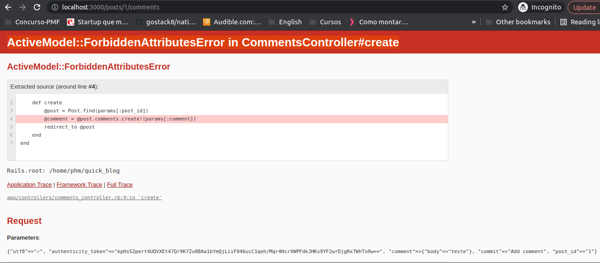

# README

This README would normally document whatever steps are necessary to get the
application up and running.

Things you may want to cover:

* Ruby version

* System dependencies

* Configuration

* Database creation

* Database initialization

* How to run the test suite

* Services (job queues, cache servers, search engines, etc.)

* Deployment instructions

* ...
# blog-app

Link de referência: 

https://reinteractive.com/posts/32-ruby-on-rails-3-2-blog-in-15-minutes-step-by-step

Erros encontrados:

Solução:

 - Fazer o ajuste no arquivo comments_controller.rb:

	@comment = @post.comments.create!(params[:comment].permit!)

Problema: Não suportado mais o div_for

Solução: 
	Adicionar no arquivo GemFile a seguinte instrução: gem 'record_tag_helper', '~> 1.0'

